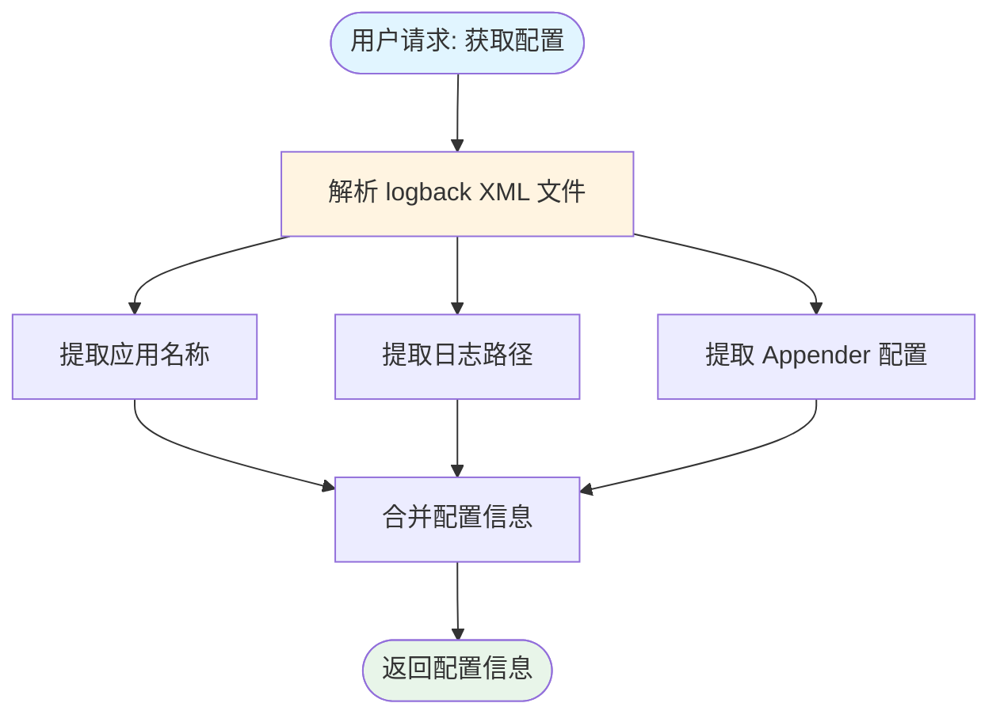

# MCP 日志分析工具 - 使用指南

一个基于 FastMCP 的 Model Context Protocol (MCP) 工具，用于分析 Java Spring Boot 应用的日志文件，自动检测代码缺陷并生成修复建议。

---

## 📋 目录

1. [功能特点](#功能特点)
2. [快速开始](#快速开始)
3. [在 Cursor 中集成](#在-cursor-中集成)
4. [工具功能](#工具功能)
5. [使用示例](#使用示例)
6. [常见问题](#常见问题)

---

## 功能特点

### 核心能力

- 🔍 **智能日志分析**：自动提取异常信息，不限于预定义模式，可以识别所有类型的异常
- 📊 **堆栈跟踪过滤**：自动保留应用包下的堆栈信息，过滤底层框架信息（如 `java.`, `org.springframework.` 等）
- 🎯 **缺陷检测**：自动识别异常类型并推断严重程度（critical / high / medium）
- 🔧 **自动修复建议**：将异常信息交给 AI 分析，生成代码修复建议
- 🌐 **跨平台支持**：支持 Windows、Linux、Mac，自动处理路径差异
- ⚙️ **零配置使用**：安装后即可使用，自动从 logback 配置读取信息
- 🚀 **Token 优化**：智能提取关键信息，过滤无关内容，减少 token 消耗

### 智能分析特性

**自动提取异常信息**：
- ✅ 自动识别所有异常类型（不限于预定义模式）
- ✅ 自动提取异常消息
- ✅ 自动推断严重程度
- ✅ 保留应用包下的堆栈信息（类名、方法名、行号）
- ✅ 过滤底层框架信息，减少冗余

**Token 优化策略**：
- ✅ 自动提取关键信息，去除冗余前缀（时间戳、PID、线程ID等）
- ✅ 过滤无关日志行（DEBUG、启动信息等）
- ✅ 限制返回数量（最多 50 个缺陷，30 个搜索结果）
- ✅ 按严重程度排序，优先显示严重问题

### 配置灵活性

工具支持多种配置方式，按优先级自动选择：

1. **方法参数**（调用时直接传入）
2. **环境变量**（Cursor MCP 配置或系统环境变量）
3. **logback 配置文件**（自动读取）
4. **默认值**（工具内置）

**无需手动配置即可使用！** 工具会自动：
- 从 logback 配置读取日志路径
- 从配置或目录名推断应用名称
- 从应用名称推断应用包名
- 处理 Windows/Linux 路径差异

---

## 快速开始

### 安装

```bash
pip install mcp-logback-analyzer
```

### 验证安装

```bash
python -c "from tools.log_analyzer_tool import LogAnalyzer; print('安装成功！')"
```

### 使用流程图


---

## 在 Cursor 中集成

### 步骤 1：找到配置文件

根据你的操作系统，找到 Cursor 的 MCP 配置文件：

**Windows:**
```
%APPDATA%\Cursor\User\globalStorage\saoudrizwan.claude-dev\settings\cline_mcp_settings.json
```

**Mac:**
```
~/Library/Application Support/Cursor/User/globalStorage/saoudrizwan.claude-dev/settings/cline_mcp_settings.json
```

**Linux:**
```
~/.config/Cursor/User/globalStorage/saoudrizwan.claude-dev/settings/cline_mcp_settings.json
```

### 步骤 2：添加配置

打开配置文件，添加以下内容：

```json
{
  "mcpServers": {
    "log-analyzer": {
      "command": "python",
      "args": ["-m", "tools.log_analyzer_tool"],
      "cwd": "${workspaceFolder}",
      "env": {
        "LOGBACK_CONFIG_PATH": "${workspaceFolder}/src/resource/logback-spring.xml"
      }
    }
  }
}
```

**说明**：
- `command`: Python 解释器命令（`python` 或 `py`）
- `args`: 使用模块方式运行（推荐）
- `cwd`: 工作目录设置为项目根目录
- `env`: 环境变量配置（可选，工具会自动从 logback 配置读取）

### 步骤 3：重启 Cursor

保存配置文件后，重启 Cursor IDE 使配置生效。

### 步骤 4：开始使用

在 Cursor 中直接与 AI 对话：

```
分析一下错误日志
搜索日志中的 NullPointerException
查看 logback 配置
```

---

## 工具功能

工具提供了 4 个主要功能：

### 1. analyze_logs - 分析日志文件

自动分析日志文件，检测代码缺陷。

**参数**：
- `log_level`: 日志级别（`"error"`, `"warn"`, `"all"`），默认 `"error"`
- `max_lines`: 最大读取行数，默认 `1000`（也可以说"检索行数"）
- `error_log_path`: 错误日志文件路径（可选）
- `warn_log_path`: 警告日志文件路径（可选）
- `all_log_path`: 全部日志文件路径（可选）

**使用示例**：
```
分析一下错误日志
分析最近 500 行的错误日志
分析警告级别的日志，检索 2000 行
分析指定路径的日志：D:\logs\error.log
```

**返回结果**：
- 缺陷列表（按严重程度排序）
- 异常类型和消息
- 应用包下的堆栈信息
- 最多返回 50 个缺陷

### 2. search_logs - 搜索日志关键词

在日志文件中搜索指定的关键词。

**参数**：
- `keyword`: 搜索关键词（必填）
- `log_level`: 日志级别，默认 `"all"`
- `max_lines`: 最大读取行数，默认 `1000`
- `error_log_path`: 错误日志文件路径（可选）
- `warn_log_path`: 警告日志文件路径（可选）
- `all_log_path`: 全部日志文件路径（可选）

**使用示例**：
```
搜索日志中的 NullPointerException
查找包含 "数据库连接失败" 的日志
在错误日志中搜索 "timeout"
```

**返回结果**：
- 匹配的日志行列表
- 行号和关键信息
- 最多返回 30 个匹配结果

### 3. get_logback_config - 获取 logback 配置

读取并解析 logback 配置文件。

**参数**：
- `logback_config`: logback 配置文件路径（可选）

**使用示例**：
```
查看 logback 配置
获取日志配置文件信息
```

**返回结果**：
- 应用名称
- 日志路径
- Appender 配置

### 4. auto_fix_defect - 生成修复建议

根据检测到的缺陷信息，生成代码修复建议。

**参数**：
- `defect_info`: 缺陷信息字典（必填）
- `source_code_path`: 源代码文件路径（可选）

**使用示例**：
```
帮我修复这个 NullPointerException
为这个数据库异常生成修复建议
```

---

## 使用示例

### 场景 1：日常错误排查

```
分析一下最近的错误日志
```

工具会自动：
1. 读取错误日志文件
2. 提取异常信息
3. 识别异常类型和严重程度
4. 返回最严重的缺陷列表

### 场景 2：搜索特定错误

```
搜索日志中的 "数据库连接超时"
```

工具会返回所有匹配的日志行，包括行号和关键信息。

### 场景 3：自定义日志路径

如果日志文件不在默认位置：

```
分析这个路径的日志：D:\logs\custom\error.log
```

或者通过环境变量配置（在 Cursor MCP 配置中）：

```json
"env": {
  "ERROR_LOG_PATH": "D:\\logs\\custom\\error.log"
}
```

### 场景 4：分析不同级别的日志

```
先分析错误日志
再分析警告日志
```

---

## 工具调用流程图

### analyze_logs - 分析日志流程


### search_logs - 搜索日志流程


### get_logback_config - 获取配置流程



### auto_fix_defect - 生成修复建议流程


---

## 配置说明

### 自动配置（推荐）

工具会自动从以下位置获取配置：

1. **logback 配置文件**：自动读取 `logback-spring.xml` 中的配置
2. **应用名称**：从 logback 配置或当前目录名自动推断
3. **日志路径**：从 logback 配置自动获取

**无需手动配置即可使用！**

### 可选配置

如果需要自定义，可以在 Cursor MCP 配置中添加环境变量：

```json
"env": {
  "LOGBACK_CONFIG_PATH": "${workspaceFolder}/src/resource/logback-spring.xml",
  "SPRING_APPLICATION_NAME": "your-app-name",
  "APP_PACKAGE": "com.example.yourpackage",
  "ERROR_LOG_PATH": "${workspaceFolder}/logs/error.log"
}
```

**环境变量说明**：

| 环境变量 | 说明 | 是否必需 |
|---------|------|---------|
| `LOGBACK_CONFIG_PATH` | logback 配置文件路径 | 否（有默认值） |
| `SPRING_APPLICATION_NAME` | 应用名称 | 否（自动推断） |
| `APP_PACKAGE` | 应用包名（用于过滤堆栈跟踪） | 否（自动推断） |
| `ERROR_LOG_PATH` | 错误日志文件路径 | 否（从 logback 读取） |
| `WARN_LOG_PATH` | 警告日志文件路径 | 否（从 logback 读取） |
| `ALL_LOG_PATH` | 全部日志文件路径 | 否（从 logback 读取） |

### 配置优先级流程图


---

## 常见问题

### Q1: 工具无法找到日志文件？

**解决方案**：

1. **检查 logback 配置**：
   ```
   查看 logback 配置
   ```

2. **使用绝对路径**：
   ```
   分析这个路径的日志：D:\data\logs\app\error.log
   ```

3. **在 Cursor MCP 配置中设置**：
   ```json
   "env": {
     "ERROR_LOG_PATH": "D:\\data\\logs\\app\\error.log"
   }
   ```

### Q2: 应用名称识别不正确？

**解决方案**：

在 Cursor MCP 配置中添加：

```json
"env": {
  "SPRING_APPLICATION_NAME": "your-app-name"
}
```

### Q3: 堆栈跟踪信息太多？

**解决方案**：

配置应用包名，工具会自动过滤框架包的堆栈信息：

```json
"env": {
  "APP_PACKAGE": "com.example.yourpackage"
}
```

工具会自动：
- 过滤掉 `java.`, `org.springframework.` 等框架包
- 只保留应用包下的堆栈信息
- 最多保留 3 层应用堆栈

### Q4: 在 Cursor 中无法使用工具？

**检查清单**：

1. ✅ 工具是否已安装：`pip show mcp-logback-analyzer`
2. ✅ MCP 配置文件是否正确
3. ✅ Cursor 是否已重启
4. ✅ Python 路径是否正确

**调试方法**：

手动测试工具：
```bash
python -m tools.log_analyzer_tool
```

如果工具正常运行，说明安装正确，问题可能在 Cursor 配置。

### Q5: Windows 路径问题？

工具会自动处理路径转换：
- Linux 路径 `/data/logs` 会自动转换为 `D:\data\logs`（根据项目所在磁盘）

如果仍有问题，使用绝对路径：
```json
"env": {
  "ERROR_LOG_PATH": "D:\\data\\logs\\app\\error.log"
}
```

---

**版本**：1.0.0  
**最后更新**：2025-01-13
